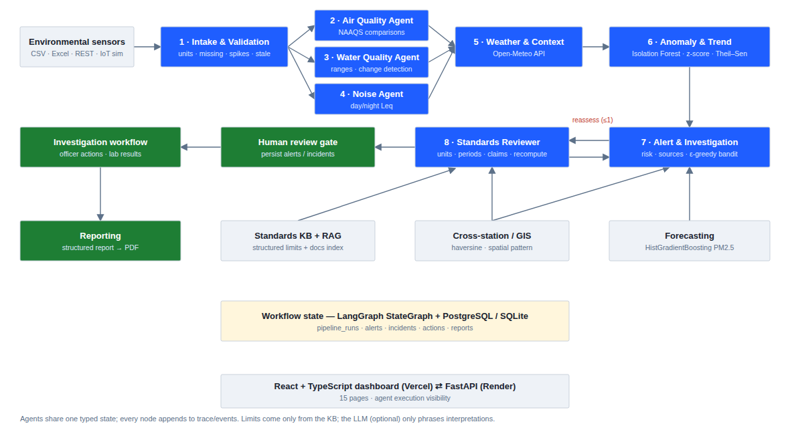
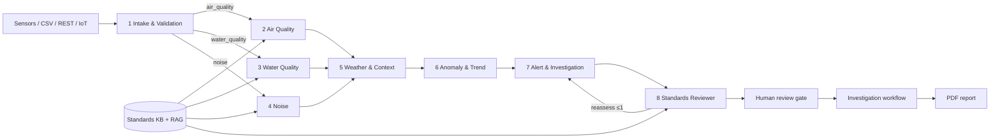

# Env Intelligence — Agentic AI Environmental Pollution Monitoring & Regulatory Alert System

A multi-agent environmental monitoring and decision-support platform. Eight specialised agents, orchestrated with **LangGraph**, validate sensor data, compare it with a **configurable environmental-standard knowledge base**, detect anomalies, add weather and cross-station context, and produce **explainable alerts, incidents and PDF reports** that an authorised officer reviews.

> Decision support only. The system never makes legal determinations, imposes penalties, or names an organisation as the cause of an event from sensor correlation. Sources are only ever described as *potential contributing source* or *source requiring investigation*.

| | |
|---|---|
| Backend | Python 3.11 · FastAPI · Pydantic · SQLAlchemy · Pandas · NumPy · SciPy · scikit-learn · LangGraph · ReportLab |
| Frontend | React 18 · TypeScript · Tailwind CSS · Recharts · Leaflet / OpenStreetMap |
| Database | SQLite (local) / PostgreSQL (Render) — TimescaleDB-compatible schema |
| RAG | TF-IDF vector index over standards documents + structured standard records |
| External API | Open-Meteo weather (no key required) |
| LLM (optional) | Anthropic / OpenAI / Gemini via `LLM_PROVIDER`; deterministic templates when not configured |
| Deploy | Backend → Render (`render.yaml`) · Frontend → Vercel (`frontend/vercel.json`) |

**Deployed URLs:** backend `https://<your-render-service>.onrender.com` · frontend `https://<your-project>.vercel.app` (fill in after deploying — see [Deployment](#deployment)).

---

## Contents
1. [Problem statement](#problem-statement) · 2. [System architecture](#system-architecture) · 3. [Multi-agent architecture](#multi-agent-architecture) · 4. [Agent prompts](#agent-prompts) · 5. [Agent-to-agent communication](#agent-to-agent-communication) · 6. [Environmental data model](#environmental-data-model) · 7. [Sensor-data ingestion & validation](#sensor-data-ingestion--validation) · 8. [Air / water / noise methodology](#air-quality-methodology) · 9. [Weather API](#weather-api-integration) · 10. [Standards RAG](#environmental-standard-rag) · 11. [Anomaly detection](#anomaly-detection-methodology) · 12. [Forecasting](#forecasting-methodology) · 13. [GIS & cross-station](#gis--cross-station-analysis) · 14. [Incident workflow & human review](#environmental-incident-workflow) · 15. [Database](#database-design) · 16. [API](#api-documentation) · 17. [Setup & deployment](#environment-variables) · 18. [Testing](#testing-methodology)

---

## Problem statement
Monitoring networks produce continuous air, water and noise measurements, but conventional systems stop at threshold alarms. Officers still investigate by hand: checking whether a reading is real or a sensor fault, finding the right standard *and averaging period*, comparing nearby stations, considering weather, and writing reports. This project automates that analysis with cooperating AI agents while keeping every number deterministic, every limit sourced, and every decision with a human.

## System architecture



```
Environmental Sensors → Data Validation → Air/Water/Noise Agents → Weather Context → Anomaly Detection
   → Environmental Standards RAG → Alert Agent ⇄ Reviewer Agent → Human Investigation → Reporting
```



## Multi-agent architecture

| # | Agent | Responsibility | Tools |
|---|---|---|---|
| 1 | **Environmental Data Intake & Validation** | Loads 30 days of history; normalises units; flags missing values, duplicate timestamps, invalid units, impossible readings, unrealistic one-hour jumps, PM2.5 > PM10, flat-lined and stale sensors. Suspicious values are **flagged, never deleted**. Emits the structured observation (same shape as the brief's example). | `validation.validate_long`, DB |
| 2 | **Air Quality Analysis** | Retrieves applicable NAAQS records, builds the matching 1/8/24-h averages, computes differences, trends, persistence (hours above limit) and cross-station comparison. | `standards.applicable`, `compliance.evaluate`, `cross_station.compare` |
| 3 | **Water Quality Analysis** | pH, DO, turbidity, conductivity, TDS, temperature vs. configured ranges/minimums; detects significant 6-h changes and hands them to the anomaly agent for classification. | `compliance.evaluate`, `water.detect_changes` |
| 4 | **Noise Pollution Analysis** | Day (06–22) / night (22–06) Leq vs. zone limits; counts repeated exceedances; hourly profile. | `compliance.noise_periods` |
| 5 | **Weather & Environmental Context** | Calls Open-Meteo (stored with source + timestamp); analyses wind, rainfall, humidity co-occurrence and weather changes in associative language only. | `weather_api.current` |
| 6 | **Pollution Anomaly & Trend Detection** | Isolation Forest scores, robust z-scores, Theil–Sen trends; classifies changes as *valid environmental change*, *sensor anomaly* or *data-quality issue*. | `ml.isolation_forest` |
| 7 | **Environmental Alert & Investigation** | Consolidates all findings into categorised, explained alerts; risk index; upwind registered-source screening; epsilon-greedy recommendation. | `geo.source_investigation`, `risk.compute`, `bandit.recommend` |
| 8 | **Environmental Standards & Reviewer** (optional agent — implemented) | Critic: re-verifies standard exists in KB and matches, units, averaging period and completeness, recomputes the difference, checks the source section is retrievable, scans all text for causal / legal / attribution claims and numbers not in evidence; corrects or sends back for reassessment. | `rag.supporting_text` |

Plus a **human-review gate** node that persists reviewed alerts (deduplicated) and incidents and sets the run to `awaiting_human_review`.

Code: `backend/app/agents/` — `orchestrator.py` builds the graph.

## Agent prompts
Full text in [`backend/app/agents/prompts.py`](backend/app/agents/prompts.py). Every prompt shares one guardrail block:

> *Use ONLY the numbers in the provided JSON facts; do not introduce new numbers or limits. Never state that weather, a facility or any organisation CAUSED an event; use "occurred during", "coincided with", "potential contributing source" or "source requiring investigation". Do not make legal determinations or mention penalties.*

Example (Alert agent): *"You are the Environmental Alert & Investigation Agent. Write a short explanation of the alert for an environmental officer: what was measured, which configured reference applies, the deterministic difference, supporting evidence (anomaly, weather, cross-station) and the recommended next step."*

The LLM is **optional**. It only phrases interpretation text from facts the tools already computed; it never supplies a limit, a number or a decision. If no key is set, or a call fails, agents fall back to deterministic templates, so the pipeline always runs. The reviewer rejects LLM text that contains numbers not present in the evidence.

## Agent-to-agent communication
Agents communicate through one typed **LangGraph state** (`PipelineState`), not free text:

| Producer | Writes | Consumed by |
|---|---|---|
| Intake | `observation`, `validation`, cleaned `wide` frame | all agents |
| Air/Water/Noise | `findings[]` (measured value, comparisons, primary comparison, trend, interpretation), `cross_station`, `water_changes`, `noise_periods` | Weather, Anomaly, Alert |
| Weather | `weather_context` (current API record, event window, associations, observations) | Anomaly (rainfall), Alert |
| Anomaly | `anomaly` (scores, contributors, classified changes, sensor flags) | Alert |
| Alert | `draft` (alerts, risk, recommendation, summary) | Reviewer |
| Reviewer | `review`, `review_feedback` → conditional edge back to Alert (max 1) | Alert, Human gate |
| All | `trace[]`, `events[]` (additive reducers) | UI visibility, audit |

Conditional edges: `intake → {air_quality | water_quality | noise}` by station type; `reviewer → alert` when reassessment is requested, else `→ human_gate`. Each run is persisted to `pipeline_runs` (status, trace, versioned events, risk, human decision). A network run executes the graph for every station and adds `PIPELINE_EXECUTED`, `RISK_EVALUATED`, `BANDIT_RECOMMENDATION` events (the dashboard's *AI Execution Timeline*).

## Environmental data model
Long format, one row per reading: `station_id, timestamp, parameter, value, unit, quality_flag (valid|suspect|missing|invalid|verified), flag_reason, source`. Canonical units: µg/m³ (PM2.5, PM10, NO₂, SO₂, O₃), mg/m³ (CO), pH, mg/L (DO, TDS), NTU, µS/cm, °C, dB(A).

**Dataset** (`backend/data/generate_data.py`, reproducible, seed 42): 30 days hourly for 8 stations around Vijayawada — 4 air (ENV-ST-001…004), 2 water (Krishna River at Prakasam Barrage, Budameru Canal), 2 noise — plus regional weather, 6 fictional registered sources and ground-truth event labels. Injected scenarios: area-wide PM episode under low wind (3 of 4 stations); the brief's example reading at ENV-ST-004 (PM2.5 92, PM10 148, NO₂ 62, SO₂ 28, CO 1.4; 31 °C, 68 %, 4.5 m/s); a CO sensor spike; missing and duplicate readings; a rain-driven turbidity rise (valid change) and a 3.2 → 12.8 NTU deterioration; a stale water sensor; repeated night-time noise. On load, timestamps are shifted so the newest record equals the current hour (*replay alignment*), keeping the demo live whenever it is deployed. Historical incidents are in `data/knowledge_base/historical_incidents.md`.

## Sensor-data ingestion & validation
- **CSV / Excel** — `POST /api/ingest/file`, long (`parameter,value,unit`) or wide (`pm2_5 (ug/m3), no2 (ppb)…`) format.
- **REST** — `POST /api/ingest/measurements` (JSON list).
- **Simulated IoT stream** — `POST /api/ingest/simulate` with scenarios `normal | exceedance | spike | turbidity_rise | night_noise | missing` (Live Monitoring page streams every 3 s and can trigger the agents on each reading).

Every path normalises units (ppm/ppb → mg/m³ / µg/m³ at 25 °C, mS/cm → µS/cm, °F → °C), validates new readings in the context of the previous 48 h, and stores flags. Officers can mark readings verified/invalid (`POST /api/measurements/{id}/flag`).

## Air-quality methodology
1. Retrieve applicable standards by jurisdiction + zone (`IN-NAAQS-*`).
2. For each, compute the average that matches the averaging period (1 h, 8 h, 24 h, annual). **A single hourly value is never compared with a 24-h limit** — if it is above the numeric limit while the 24-h mean is not, the status is `indicative_hourly_above`, not an exceedance.
3. Data completeness ≥ 75 % is required, otherwise `indicative_exceedance`. Annual standards with 30 days of data are `not_assessable`.
4. `Difference = period value − limit`, `% = Difference / limit × 100` (deterministic; min limits use `limit − value`, ranges use distance outside the bound).
5. Trend: Theil–Sen slope + Spearman test (72 h); persistence: hours above the numeric limit in 24 h; cross-station comparison.

Example (ENV-ST-004): latest 1-h PM2.5 = 92 µg/m³; 24-h mean = 99.1; NAAQS 24-h limit 60 → **+39.1 µg/m³ (+65.2 %)**, coverage 100 % → *Critical Review Required*; 3 of 4 stations elevated → *distributed*; *"occurred during low-wind conditions"*.

The UI shows **Measured Value · Applicable Reference Limit · Calculated Exceedance · AI Interpretation** in separate columns/blocks.

## Water-quality methodology
Instantaneous criteria from CPCB designated-best-use classes (Class C configured: pH 6–9, DO ≥ 4 mg/L). Turbidity and TDS use IS 10500:2012 permissible limits **configured as screening benchmarks** (labelled; a screening exceedance is capped at *Investigation Required*). Conductivity uses a labelled site operating baseline. Significant 6-h changes are classified by the anomaly agent: suspect flags → *sensor anomaly*; ≥3 missing hours → *data-quality issue*; sustained ≥4 h with co-movement (DO ↓, conductivity/TDS ↑) → *valid environmental change* (with rainfall context); otherwise *undetermined*. No pollution source is identified.

## Noise-analysis methodology
`Leq = 10·log10(mean(10^(Li/10)))` over hourly LAeq values in each day/night window (Noise Rules 2000 definitions), assessed when ≥ 75 % of hours are present. Zone limits from the configured KB (industrial 75/70, commercial 65/55, residential 55/45, silence 50/40 dB(A)). ≥ 3 exceedances in the last 7 complete periods → *persistent_elevated* → incident.

## Weather API integration
`services/weather_api.py` calls **Open-Meteo** `forecast` (current + 48 h hourly, m/s, Asia/Kolkata). Each record is stored in `weather` with `source` and `retrieved_at`. If the API is unreachable, the agent uses the latest stored observation and labels it `dataset-fallback (Open-Meteo unreachable)`. The hourly forecast also feeds the PM2.5 forecaster.

## Environmental-standard RAG
- **Structured part** — `data/standards/standards.json` → `standards` table; editable via `POST/PUT /api/standards`. Each record: standard name, issuer, parameter, limit / min / max, averaging period, unit, zones or water classes, source document, section, version, basis (`regulatory | screening_benchmark | site_baseline`).
- **Document part** — `data/knowledge_base/*.md` (NAAQS 2009, Noise Rules 2000, CPCB best-use criteria, IS 10500, monitoring guidelines, sensor manuals, site baseline, historical incidents), chunked by section and indexed with TF-IDF (1–2-grams) + cosine similarity together with every standard record. The interface (`search`, `ask`, `supporting_text`) is storage-agnostic and can be swapped for pgvector / ChromaDB / FAISS embeddings.
- **"What standard was used for this alert?"** — `POST /api/standards/ask {alert_id}` returns source document, section, applicable limit, averaging period, unit and the supporting text. Free questions return cited passages (LLM synthesis if configured, extractive otherwise).

> The sample standard values are transcribed from public Indian notifications for demonstration — verify against the official gazette before any operational use.

## Anomaly-detection methodology
- **Data / features** — per domain, each station's readings are robust-standardised against its own history (median / IQR) so one model generalises across stations; plus first differences, hour-of-day sin/cos, night flag (noise) and wind speed / humidity (air).
- **Algorithm** — `IsolationForest(n_estimators=200, contamination=0.03)`: unsupervised (no labelled pollution events exist in practice), multivariate (catches unusual pollutant combinations and abnormal station behaviour), fast on CPU. Robust z-scores give interpretable contributors; Theil–Sen catches gradual deterioration.
- **Training** — on data older than 48 h, so the current event is never part of its own baseline; cached per day.
- **Evaluation** — chronological split (train 20 days, test 10 days) against injected labels:

| Domain | Isolation Forest P / R / F1 | Robust z-score baseline P / R / F1 |
|---|---|---|
| Air | 0.796 / 0.932 / **0.859** | 0.764 / 0.920 / 0.835 |
| Water | 0.545 / 1.000 / 0.706 | 1.000 / 1.000 / **1.000** |
| Noise | 0.424 / 0.583 / **0.491** | 0 / 0 / 0 |

Isolation Forest wins on multi-pollutant air events and day/night noise patterns; the simple z-score is better for the single-parameter water deterioration — which is why the agent uses both. (Metrics regenerate to `data/models/anomaly_metrics.json`.)

## Forecasting methodology
`HistGradientBoostingRegressor` on lags 1, 2, 3, 6, 24 h, rolling means (6, 24 h), temperature, humidity, wind speed, hour sin/cos, day of week. Chronological hold-out = last 5 days. Recursive multi-step forecasts; future weather from the Open-Meteo hourly forecast, else diurnal persistence (stated in the output). ≈80 % interval from 24-h backtest residuals.

| ENV-ST-004 PM2.5 | MAE | RMSE | MAPE |
|---|---|---|---|
| Model, one-step | **12.16** | **20.66** | **15.6 %** |
| Persistence (t−24 h) | 16.88 | 27.36 | 22.4 % |
| Model, recursive 24-h backtest | **15.05** | **16.50** | 18.4 % |
| Persistence, 24-h backtest | 18.94 | 20.79 | — |

## GIS & cross-station analysis
Leaflet + OpenStreetMap map of stations (colour = alert status; popup with type, status, key reading, latest measurement time) and registered sources. Cross-station analysis compares each station's matching-period mean with its configured reference (or 1.5 × baseline) for stations within 20 km and classifies the pattern as *localized*, *partially distributed*, *distributed* or *not elevated* — always adding *"spatial pattern alone does not identify a pollution source"*. Source-investigation support lists registered units within 5 km whose bearing lies within ±45° of the wind-from direction during the event, labelled *source requiring investigation — not confirmed*.

## Environmental incident workflow
Alert categories: **Normal · Observation · Elevated · Investigation Required · Sensor Verification Required · Critical Review Required**, each with a *why* explanation. Normal/Observation stay in the run record (no alert noise); Elevated+ become alerts; Investigation-level+ open or update an incident.

**De-duplication** — an active alert with the same station, parameter and type is updated (occurrence count, latest evidence) instead of duplicated; one open incident per station and kind (environmental vs. sensor).

**Investigation actions** (Investigation Center): review, verify sensor, request field inspection, start investigation, assign, add observation, add laboratory result, confirm / reject anomaly, record correction to a regulatory comparison, escalate, close, reopen — all timestamped in `incident_actions`.

**Recommendations** — an epsilon-greedy contextual bandit (ε = 0.1, Beta(1,1) prior; context `domain:category`) ranks follow-up actions; officers' *Useful / Not useful* feedback is the reward. It suggests; humans decide.

## Human-review mechanism
Officers can approve, reject or request reassessment of a pipeline run (`/api/pipeline/runs/{id}/decision`), acknowledge / confirm / reject / close alerts, correct sensor data, record investigation findings, approve reports (PDF shows review status), and close incidents. Rejections mark alerts as false positives.

## Database design
`stations` · `measurements` (indexed station/parameter/timestamp — convert to a TimescaleDB hypertable on `timestamp` for production) · `weather` · `registered_sources` · `standards` · `alerts` · `incidents` · `incident_actions` · `pipeline_runs` · `reports` · `bandit_arms`. Models: `backend/app/database.py`.

## API documentation
Interactive OpenAPI docs at **`/docs`**. Main endpoints:

| Area | Endpoints |
|---|---|
| Health | `GET /api/health` |
| Stations | `GET/POST /api/stations`, `GET/PUT/DELETE /api/stations/{id}`, `GET /api/stations/{id}/series` |
| Data | `GET /api/live`, `POST /api/ingest/measurements`, `POST /api/ingest/file`, `POST /api/ingest/simulate`, `POST /api/measurements/{id}/flag` |
| Analytics | `GET /api/dashboard`, `GET /api/domain/{air\|water\|noise}`, `GET /api/noise/{id}`, `GET /api/map`, `GET /api/cross-station`, `GET /api/forecast/{id}`, `GET /api/models/anomaly`, `GET /api/weather/current`, `GET /api/weather/history` |
| Agents | `POST /api/pipeline/run`, `POST /api/pipeline/run-network`, `GET /api/pipeline/graph`, `GET /api/pipeline/runs[/{id}]`, `POST /api/pipeline/runs/{id}/decision` |
| Alerts / incidents | `GET /api/alerts[/{id}]`, `POST /api/alerts/{id}/action`, `GET /api/incidents[/{id}]`, `POST /api/incidents/{id}/actions`, `POST /api/incidents/{id}/recommendation-feedback` |
| Standards | `GET/POST /api/standards`, `PUT /api/standards/{id}`, `GET /api/standards/search`, `POST /api/standards/ask` |
| Reports | `POST /api/reports/generate`, `GET /api/reports[/{id}]`, `POST /api/reports/{id}/approve`, `GET /api/reports/{id}/pdf` |
| Admin | `POST /api/admin/reset-demo` |

## Environment variables
Backend (`backend/.env.example`): `DATABASE_URL`, `CORS_ORIGINS`, `LLM_PROVIDER`, `LLM_MODEL`, `ANTHROPIC_API_KEY` / `OPENAI_API_KEY` / `GEMINI_API_KEY`, `ENABLE_LIVE_WEATHER`, `NETWORK_ID`, `CROSS_STATION_RADIUS_KM`, `SOURCE_SEARCH_RADIUS_KM`, `STALE_AFTER_HOURS`, `MIN_COVERAGE`, `BANDIT_EPSILON`, `SEED_ON_STARTUP`.
Frontend (`frontend/.env.example`): `VITE_API_URL`.

## Backend setup
```bash
cd backend
python -m venv .venv && source .venv/bin/activate      # Windows: .venv\Scripts\activate
pip install -r requirements.txt
uvicorn app.main:app --reload --port 8000              # seeds the DB on first start
```
Regenerate the dataset: `python data/generate_data.py` (then delete `envintel.db` or call `POST /api/admin/reset-demo`).

## Frontend setup
```bash
cd frontend
npm install
echo "VITE_API_URL=http://localhost:8000" > .env
npm run dev        # http://localhost:5173
```

## Local execution (demo walkthrough)
1. **Dashboard** → *Run Environmental Analysis* (runs all 8 agents over 8 stations).
2. **Pipeline Demo** → open a station run to see each agent's input, tool calls, retrieved standard, model output and reviewer checks; approve or request reassessment.
3. **Alerts** → open the PM2.5 alert → *What standard was used for this alert?*
4. **Pollution Map** → cross-station pattern; **Water Quality** → turbidity change classification; **Noise** → night heatmap.
5. **Investigation Center** → request field inspection, add a lab result, rate the recommendation, close/escalate.
6. **Trends & Forecasts** → 24-h PM2.5 forecast with MAE/RMSE/MAPE; **Reports** → generate, approve, download PDF.
7. **Live Monitoring** → stream the *spike* scenario with "Run agents on each reading" to see *Sensor Verification Required*.

## Deployment
**Backend (Render)** — push the repo, *New → Blueprint*, select `render.yaml` (creates the web service + free PostgreSQL). Set `CORS_ORIGINS` to the Vercel URL and optionally an LLM key. Health check: `/api/health`.
**Frontend (Vercel)** — *New Project* → root directory `frontend` → framework Vite → env `VITE_API_URL=https://<render-service>.onrender.com` → deploy. `vercel.json` handles SPA routing.
(Render free instances sleep; the first request after idle takes ~30–60 s.)

## Testing methodology
```bash
cd backend
pytest -q                                   # 17 tests: 8 scenarios + 9 unit tests
python scripts/run_test_scenarios.py        # writes docs/TEST_RESULTS.md/.json + docs/sample_environmental_report.pdf
```
Scenario code (`tests/scenarios.py`) creates controlled stations via the API, ingests data, runs the agents and records input, initial state, expected/actual output, agents involved, model/API output, evidence and pass/fail. Live weather is disabled in tests for determinism.

| Test | Scenario | Expected | Result |
|---|---|---|---|
| TC-01 | Normal environmental readings | No unnecessary alert | ✅ |
| TC-02 | Pollutant exceeds configured reference | Alert with deterministic difference | ✅ |
| TC-03 | Sudden unrealistic sensor spike | Sensor verification requested, no false exceedance | ✅ |
| TC-04 | Water turbidity rises significantly | Water-quality anomaly identified | ✅ |
| TC-05 | Repeated high night-time noise | Noise incident generated | ✅ |
| TC-06 | Multiple stations elevated | Cross-station analysis (2 of 3 → distributed) | ✅ |
| TC-07 | Pollution rises during changing weather | Weather context, no causal claims | ✅ |
| TC-08 | Future values requested | 24-h forecast + MAE/RMSE/MAPE | ✅ |

Full documented results: [`docs/TEST_RESULTS.md`](docs/TEST_RESULTS.md).

## Repository layout
```
backend/
  app/agents/        8 agents, prompts, LangGraph orchestrator
  app/tools/         validation, compliance, standards, rag, geo, cross_station, bandit, llm
  app/ml/            anomaly_model.py, forecast_model.py
  app/services/      weather_api, analysis, reports      app/reports/ pdf_report.py
  app/api/routes.py  REST API                             data/ dataset, standards, knowledge base
  tests/  scripts/
frontend/src/pages/  15 pages (Dashboard … Technical Explain)
docs/                architecture diagram, test results, sample PDF report
render.yaml
```

## Major technical decisions
- **Deterministic numbers, generative words.** Limits, averages, differences, scores and categories come from code; the optional LLM only phrases interpretations, and a critic agent checks them.
- **Averaging-period discipline** is enforced in one tool and re-checked by the reviewer.
- **Flag, don't delete** suspicious data; exclude it from compliance until verified.
- **Unsupervised anomaly detection** with an honest baseline comparison instead of claiming a single best model.
- **Screening benchmarks and site baselines are labelled** and cannot trigger *Critical* on their own.
- **Graceful degradation** — no LLM key, no internet weather, or no PostgreSQL: the system still runs and says which fallback it used.
"# environmental-monitoring-system" 
"# environmental-monitoring-system" 
